# Reflection Tree — Visual Diagram

```mermaid
graph TD
    START["🌙 START<br/>Good evening..."]
    START --> A1_OPEN

    subgraph AXIS1["Axis 1: Locus — Victim vs Victor"]
        A1_OPEN["❓ A1_OPEN<br/>Describe today in one word?<br/>Tough | Productive | Draining | Surprising | Ordinary"]
        A1_OPEN --> A1_D1{"🔀 A1_D1<br/>Route by answer"}
        
        A1_D1 -->|"Productive / Surprising"| A1_Q_AGENCY_HIGH
        A1_D1 -->|"Tough / Draining / Ordinary"| A1_Q_AGENCY_LOW
        
        A1_Q_AGENCY_HIGH["❓ A1_Q_AGENCY_HIGH<br/>What made it happen?<br/>4 options"]
        A1_Q_AGENCY_LOW["❓ A1_Q_AGENCY_LOW<br/>First instinct when difficult?<br/>4 options"]
        
        A1_Q_AGENCY_HIGH --> A1_D2_HIGH{"🔀 Route"}
        A1_Q_AGENCY_LOW --> A1_D2_LOW{"🔀 Route"}
        
        A1_D2_HIGH -->|"Internal"| A1_Q_OWNERSHIP
        A1_D2_HIGH -->|"External"| A1_Q_HIDDEN_AGENCY
        A1_D2_LOW -->|"Internal"| A1_Q_OWNERSHIP
        A1_D2_LOW -->|"External"| A1_Q_HIDDEN_AGENCY
        
        A1_Q_OWNERSHIP["❓ A1_Q_OWNERSHIP<br/>How did your decision feel?<br/>4 options"]
        A1_Q_HIDDEN_AGENCY["❓ A1_Q_HIDDEN_AGENCY<br/>Can you spot your choice?<br/>4 options"]
        
        A1_Q_OWNERSHIP --> A1_D3{"🔀 Route"}
        A1_Q_HIDDEN_AGENCY --> A1_D3B{"🔀 Route"}
        
        A1_D3 -->|"High agency"| A1_R_INT
        A1_D3 -->|"Mixed"| A1_R_MIX
        A1_D3B -->|"Found agency"| A1_R_MIX
        A1_D3B -->|"Reactive"| A1_R_EXT
        
        A1_R_INT["💭 A1_R_INT<br/>You see your agency...<br/>signal: axis1:internal"]
        A1_R_MIX["💭 A1_R_MIX<br/>Tension is where growth lives...<br/>signal: axis1:internal"]
        A1_R_EXT["💭 A1_R_EXT<br/>Micro-choices count...<br/>signal: axis1:external"]
    end
    
    A1_R_INT --> BRIDGE_1_2
    A1_R_MIX --> BRIDGE_1_2
    A1_R_EXT --> BRIDGE_1_2
    
    BRIDGE_1_2["🌉 BRIDGE_1_2<br/>From how you handled → what you gave"]
    BRIDGE_1_2 --> A2_OPEN

    subgraph AXIS2["Axis 2: Orientation — Contribution vs Entitlement"]
        A2_OPEN["❓ A2_OPEN<br/>One interaction with a colleague?<br/>4 options"]
        A2_OPEN --> A2_D1{"🔀 Route"}
        
        A2_D1 -->|"Giving"| A2_Q_GIVING
        A2_D1 -->|"Receiving"| A2_Q_RECEIVING
        
        A2_Q_GIVING["❓ A2_Q_GIVING<br/>What was your feeling?<br/>4 options"]
        A2_Q_RECEIVING["❓ A2_Q_RECEIVING<br/>How does it sit with you?<br/>4 options"]
        
        A2_Q_GIVING --> A2_D2_GIVE{"🔀 Route"}
        A2_Q_RECEIVING --> A2_D2_RECV{"🔀 Route"}
        
        A2_D2_GIVE -->|"Pure giving"| A2_R_CONTRIBUTION
        A2_D2_GIVE -->|"Mixed"| A2_R_MIXED
        A2_D2_RECV -->|"Grateful"| A2_R_MIXED
        A2_D2_RECV -->|"Entitled"| A2_R_ENTITLEMENT
        
        A2_R_CONTRIBUTION["💭 A2_R_CONTRIBUTION<br/>Gave without score...<br/>signal: axis2:contribution"]
        A2_R_MIXED["💭 A2_R_MIXED<br/>Tension between giving/expecting...<br/>signal: axis2:contribution"]
        A2_R_ENTITLEMENT["💭 A2_R_ENTITLEMENT<br/>Watch the ledger...<br/>signal: axis2:entitlement"]
    end
    
    A2_R_CONTRIBUTION --> BRIDGE_2_3
    A2_R_MIXED --> BRIDGE_2_3
    A2_R_ENTITLEMENT --> BRIDGE_2_3
    
    BRIDGE_2_3["🌉 BRIDGE_2_3<br/>From 'me' to 'us'"]
    BRIDGE_2_3 --> A3_OPEN

    subgraph AXIS3["Axis 3: Radius — Self-Centrism vs Altrocentrism"]
        A3_OPEN["❓ A3_OPEN<br/>Who comes to mind first?<br/>4 options"]
        A3_OPEN --> A3_D1{"🔀 Route"}
        
        A3_D1 -->|"Just me"| A3_Q_NARROW
        A3_D1 -->|"Others"| A3_Q_WIDE
        
        A3_Q_NARROW["❓ A3_Q_NARROW<br/>Widen the frame — who else?<br/>4 options"]
        A3_Q_WIDE["❓ A3_Q_WIDE<br/>What to do tomorrow?<br/>4 options"]
        
        A3_Q_NARROW --> A3_D2_NARROW{"🔀 Route"}
        A3_Q_WIDE --> A3_D2_WIDE{"🔀 Route"}
        
        A3_D2_NARROW -->|"Expanded"| A3_R_EXPANDING
        A3_D2_NARROW -->|"Still self"| A3_R_SELF
        A3_D2_WIDE -->|"For others"| A3_R_ALTROCENTRIC
        A3_D2_WIDE -->|"Just my part"| A3_R_EXPANDING
        
        A3_R_ALTROCENTRIC["💭 A3_R_ALTROCENTRIC<br/>Self-transcendence...<br/>signal: axis3:altrocentric"]
        A3_R_EXPANDING["💭 A3_R_EXPANDING<br/>Small but significant shift...<br/>signal: axis3:altrocentric"]
        A3_R_SELF["💭 A3_R_SELF<br/>Try asking someone...<br/>signal: axis3:selfcentric"]
    end
    
    A3_R_ALTROCENTRIC --> SUMMARY
    A3_R_EXPANDING --> SUMMARY
    A3_R_SELF --> SUMMARY
    
    SUMMARY["📋 SUMMARY<br/>Your reflection tonight..."]
    SUMMARY --> CLOSING_Q
    CLOSING_Q["❓ CLOSING_Q<br/>One thing to do differently tomorrow?<br/>5 options"]
    CLOSING_Q --> CLOSING_R["💭 CLOSING_R<br/>Small shifts, repeated..."]
    CLOSING_R --> END["🌙 END<br/>See you tomorrow."]
    
    style AXIS1 fill:#1a1a2e,stroke:#e74c3c,stroke-width:2px,color:#fff
    style AXIS2 fill:#1a1a2e,stroke:#f39c12,stroke-width:2px,color:#fff
    style AXIS3 fill:#1a1a2e,stroke:#2ecc71,stroke-width:2px,color:#fff
    style START fill:#6c5ce7,color:#fff,stroke:none
    style END fill:#6c5ce7,color:#fff,stroke:none
    style BRIDGE_1_2 fill:#636e72,color:#fff,stroke:none
    style BRIDGE_2_3 fill:#636e72,color:#fff,stroke:none
    style SUMMARY fill:#0984e3,color:#fff,stroke:none
```

## Node Count Summary

| Node Type | Count | Requirement | Status |
|-----------|-------|-------------|--------|
| Question | 10 | 8+ | ✅ |
| Decision | 9 | 4+ | ✅ |
| Reflection | 9 | 4+ | ✅ |
| Bridge | 2 | 2+ | ✅ |
| Summary | 1 | 1+ | ✅ |
| Start/End | 2 | — | ✅ |
| Closing | 2 | — | Bonus |
| **Total** | **35** | **25+** | ✅ |
